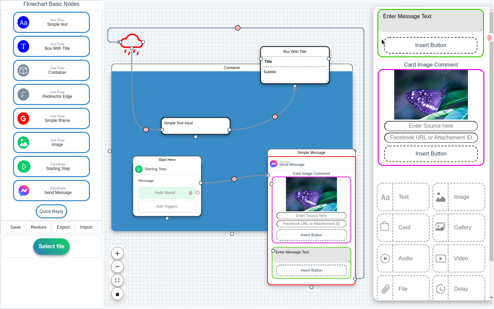

# Facebook Messenger Flowchart
[](https://opensource.org/licenses/MIT)

This app is an example of how to use [vue-flow](https://github.com/bcakmakoglu/vue-flow) with [Pinia](https://pinia.vuejs.org/) store, to create a flow with custom components, its main purpose is to create
flowchart that helps to describe Facebook Messenger bot action. The flowchart and all of its data can be exported and imported to simple text file. The project is just at it's begining but many functionnality will be implemented.

## Demo
A functional demo of the App can be found on : 
https://www.baiboly.site/apps/messenger-flowchart

## How It Works

- **Nodes** can be dragged from the sidebar and dropped into the view.
- Adding **Messenger Items** can be done using the messenger editor, to open it we just have to double click a Facebook Send Message Node.
- All functionnality of [vue-flow](https://github.com/bcakmakoglu/vue-flow) can be used on it like all keyboards shortcuts as "BackSpace" for deleting elements and "Shift" to toogle selection so it is possible to drag many nodes at once.

## Screenshoot



## Description of custom components
### Primary Components

* `Simple Text` : A node that is used as simple text container.
* `Box with title` : As the previous node, this one has two more inputs, and a label and a title.
* `Container` : **[Resizable]** This components has many special features, it cas be used as a parent to other components. Dragging directly a node from the sidebar into its body will set this one as the dragged node's parent. As described in [vue-flow](https://github.com/bcakmakoglu/vue-flow) docs when a parent container move, all of it's childs will move along him, it is possible to dynamicaly set and unset the parent of a child by using the `Menu` that is displayed when the element is hovered.
* `Redirector Edge` : The use case of this node is to redirect the edge from the right hanlde of a node to it's left Handle, so it is possible to get a better control on how the flow returns back in the diagram.
* `Simple Iframe` : **[Resizable]** [vue-flow](https://github.com/bcakmakoglu/vue-flow) is a tool that helps us to dynamicaly move DOM elements in the view, so all elements that exists can be used as a custom node, this one is a simple iFrame that accept links as Dynamic input.
* `Image` : **[Resizable]** It is possible to display an image directly in a custom node, as we stated earlier, the example of a Vide is shown in the secondary components inside a Facebook Message node.
* `Starting Step` : A simple node that helps to describe a step that will trigger a Message, or everything else.
* `Send Message` : This node displays secondary components inside it, we can toggle the `Message Editor` by double clicking the node itself.
* `Quick Reply` : This components will display a Quick Reply like node.

#### Custom Edges
  Edges gets its source from a Handle to point to another Handle, Edges in VueFlow is just a simple SVG, so we can create a custom Edge by creating custom SVG. VueFlow offer a great flexibility with this aproach. I tryed to handle as much case as I could and colored to red unhandled Edges cases.

### Secondary Components
* `Message Editor` : The message editor helps to add or to delete elements in the `Send Message` node. To open it, we can double click into a Facebook Message Node. The same action can be used to close it, or we can just use the "Esc" button.

It is worth to note that `Drag and Drop` functionnalities are enabled only in it to helps sorting the created elements. 

This is the lists of all components available as Facebook Message : 

  - `Simple Message Text` : We can add up to three buttons. 
  - `Image` : With two inputs, one of them is an input source, if filled, it will change the image by the one which the url is redirecting to, and a button.
  - `Card` : Similar to the image, but it has three inputs, a source, a title and a subtitle. It has also three buttons and a default action.
  - `Audio, File, Delay, UserInput, Dynamic` : These three elements are just a simple input with some styles and logos.
  - `Video` : This one can take a video url as an input, so it can play it directly in the flowchart.

More informations on the messenger custom message that Facebook Messenger API expose can be found on their official documentation : 
[Meta For Developers](https://developers.facebook.com/docs/messenger-platform/reference/send-api/).

:point_up: This another program also written in [Vue.js](https://vuejs.org/) was created to make the process of creating all types of message as a JSON less painfull :wink: : [fb-send-api-helper](https://github.com/MJaonary/fb-send-api-helper).

## Menu Functionalities
When we hover an node, a little menu will always apear at the top of the components :

* `Color Picker` : It can be used to change the color attribute of nodes by dynamicaly choosing a custom color.
* `Delete Icon` : Instead of the VueFlow default delete function by directly pressing "BackSpace", we can use this menu button to trigger the same action.
* `Copy Icon` : A node can be duplicated by pressing this button, the result is a different element, with the same type and the same content.
* `Setting Icon` : `Container` It was stated before that a container can act as a parent for one or many node, we can dynamicaly assign or remove a parent from the menu with this option.

## Save - Restore - Import - Export
These four functionnality helps to save localy and share the generated flowchart.
* `Save` : This option will save the current state of the flowchart to the localStorage.
* `Restore` : The Restore option work with the `Save` one, to restore directly the latest saved state by replacing all of it.
* `Export` : When this option is choosen, the latest state will be exported to a filen, in this case, downloaded.
* `Import` : A valid exported file can be imported and stored as a new saved state that we can `Restore`.

## Project Setup

The project is a Vuejs app created using Vite.

```sh
npm install
```

### Compile and Hot-Reload for Development

```sh
npm run dev
```

### Compile and Minify for Production

```sh
npm run build
```

## 💝 Special Thanks

This project is built with

- [vue-flow](https://github.com/bcakmakoglu/vue-flow)
  - Vue flow made possible building this tool by simplifing everything.

- [vue-smooth-dnd](https://github.com/kutlugsahin/vue-smooth-dnd)
  - This tools helped with the Drag and Drop Functionality. 
